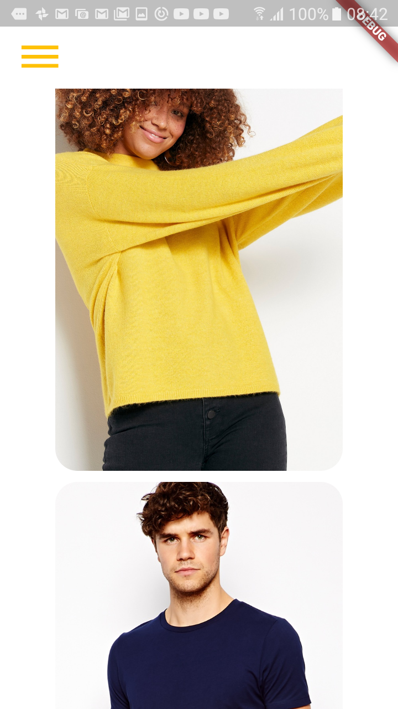
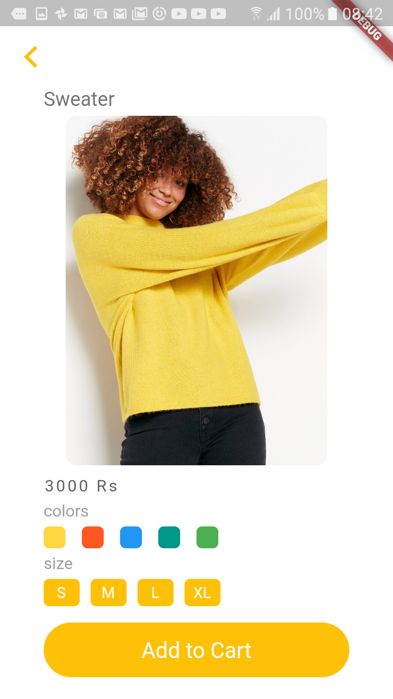
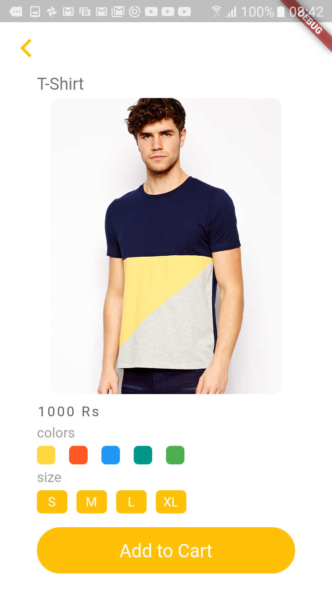

# Online store (Mobile Application)

In this pratice project I implemented this 
[online fashion store](https://dribbble.com/shots/8138861-Fashion-Online-App-Store) *concept design* into a *static mobile application*.

## Technology and platform
Framework: flutter

Platroms: Android and ios
1. Android -> Developed and tested
2. ios -> deeloped (not tested yet)

## Challange in implementation
I faced a problem while using ListView. When I scrolled there was a shadow at the end of screen that didn't match the theme of concept design. Then I figured out that you can control it by using the theme under the MaterialApp().


## Theme Data
the code is: 
```
theme: ThemeData(
accentColor: Colors.amber[200],
),
```

## Reference to concept design
Designer name: 
[Daria](https://dribbble.com/Vostres)

Design:
[online fashion store](https://dribbble.com/shots/8138861-Fashion-Online-App-Store) 


## Completed Design
|Home Page|Product 1|Product 2|
|---|---|---|
||||

## Follow me
// you can add your social medias if you want
